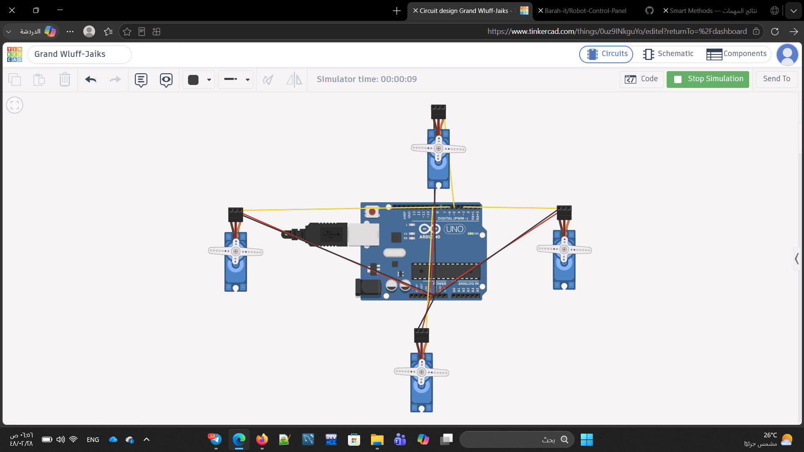

# 4 Servo Motors Control

A Tinkercad Arduino project that controls four servo motors through two sequential movements.

## Movements

- Sweep: Motors move between 0° and 180° for 2 seconds.
- Hold: Motors stop and hold at 90°.

## Components

- Arduino Uno
- 4× Micro Servo Motors
- Jumper Wires
- Tinkercad

## Implementation

The project uses the Servo.h library and millis() to control the movement duration. After 2 seconds, all servos are positioned at 90° and held there.

## Circuit

## Files

- servo_4motors.ino — Arduino code
- tinkercad_circuit.png — Circuit screenshot
- Simulation Video — Demonstration
